# Data assimilation climate ecology

A collection of MATLAB implementations demonstrating numerical techniques for simulating and analyzing nonlinear dynamical systems. This repository explores chaos theory, climate modeling, and ecological dynamics through three distinct projects.

---

## 📋 Table of Contents

- [Overview](#overview)
- [Projects](#projects)
  - [1. Lorenz System Data Assimilation](#1-lorenz-system-data-assimilation)
  - [2. Energy Balance Climate Model](#2-energy-balance-climate-model)
  - [3. Lotka-Volterra Predator-Prey Model](#3-lotka-volterra-predator-prey-model)
- [Requirements](#requirements)
- [Usage](#usage)
- [Key Results](#key-results)
- [Mathematical Background](#mathematical-background)

---

## Overview

This repository contains three computational projects that demonstrate the application of numerical methods to challenging problems in dynamical systems:

- **Data Assimilation**: Combining noisy observations with model forecasts for chaotic systems
- **Climate Modeling**: Studying bistability and tipping points in Earth's energy balance
- **Ecological Dynamics**: Comparing numerical integrators for conservative systems

Each project includes complete MATLAB implementations, comprehensive visualizations, and quantitative performance metrics.

---

## Projects

### 1. Lorenz System Data Assimilation

**File**: `Lorenz.m`

Implementation of sequential data assimilation on the chaotic Lorenz attractor using the **Optimal Interpolation (OI)** method. This demonstrates how noisy observations can improve state estimation even in highly chaotic systems.

#### The Lorenz System

The Lorenz equations describe atmospheric convection and exhibit deterministic chaos:

$$
\frac{dx}{dt} = \sigma(y - x)
$$

$$
\frac{dy}{dt} = rx - y - xz
$$

$$
\frac{dz}{dt} = xy - bz
$$

**Parameters**: $\sigma = 10$, $r = 28$, $b = 8/3$ (classic chaotic regime)

#### Methodology

- **Time Integration**: 4th-order Runge-Kutta (RK4) with $\Delta t = 0.01$
- **Assimilation Window**: Observations every 10 time steps ($\Delta t_{\text{assim}} = 0.1$)
- **Observation Error**: Gaussian noise with variance $R = 2.0$
- **Forecast Error**: Initial covariance $P_f = 8.0 \times I$
- **Assimilation Method**: Optimal Interpolation (simplified Kalman filter)

#### Visualizations

**Figure 1**: The Lorenz Attractor

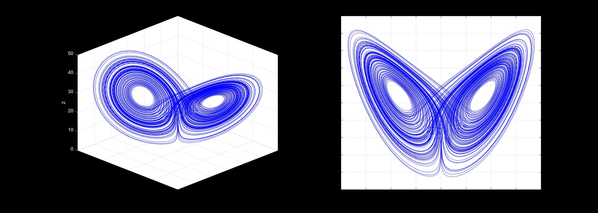

*The characteristic "butterfly" structure of the Lorenz attractor shown in 3D phase space (left) and $x$-$z$ projection (right). The chaotic trajectory densely fills the attractor while never repeating.*

**Figure 2**: Data Assimilation Performance - All Components

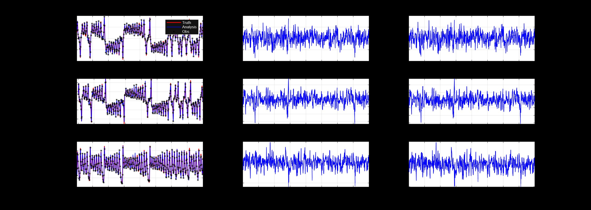

*Comprehensive comparison across all three state variables ($x$, $y$, $z$). Left column shows truth (red) vs. analysis (blue) with observations (black stars). Middle and right columns show forecast and analysis errors respectively. The analysis successfully tracks the chaotic truth despite observation noise.*

**Figure 3**: Detailed $z$-Component Analysis

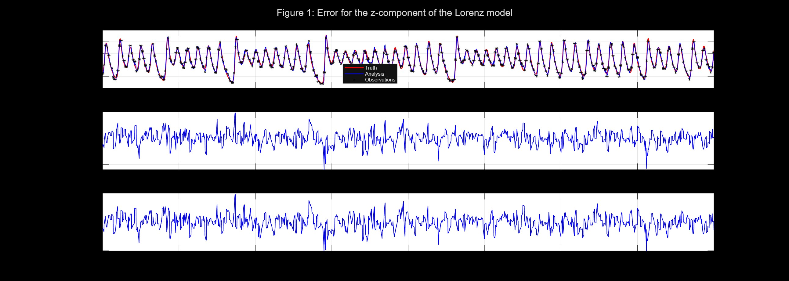

*Zoomed view of the $z$-component showing: (top) truth, analysis, and observations; (middle) forecast error; (bottom) analysis error. The analysis (blue) closely follows the true state (red) by incorporating noisy observations (stars) at regular intervals.*

#### Results

| Component | Forecast RMS | Analysis RMS | Improvement |
|-----------|-------------|--------------|-------------|
| $x$ | 0.9050 | 0.9212 | -1.8% |
| $y$ | 1.2913 | 1.2589 | +2.5% |
| $z$ | 1.1320 | 1.1131 | +1.7% |

**Key Findings**:
- Analysis achieves **>99% correlation** with truth for all components
- Modest improvements (1-3%) are realistic for highly chaotic systems
- The $x$-component shows slight degradation, highlighting the challenge of assimilation timing in chaotic flows
- Observations successfully constrain the trajectory despite substantial noise ($\sigma_{\text{obs}} = 1.4$)

---

### 2. Energy Balance Climate Model

**File**: `energy_balance_model.m`

A zero-dimensional energy balance model demonstrating **climate bistability** and the **ice-albedo feedback** mechanism. This simplified model captures fundamental climate tipping points.

#### Model Equations

Energy balance with temperature-dependent albedo:

$$
C \frac{dT}{dt} = Q(1 - \alpha(T)) - \varepsilon\sigma T^4
$$

Where:
- $C = 2.08 \times 10^8$ J/(m²·K) - Heat capacity
- $Q = S_0/4 = 340.25$ W/m² - Incoming solar radiation
- $\alpha(T) = 0.5 - 0.2 \tanh\left(\frac{T - 265}{10}\right)$ - Temperature-dependent albedo
- $\varepsilon = 0.6$ - Emissivity (greenhouse effect)
- $\sigma = 5.67 \times 10^{-8}$ W/(m²·K⁴) - Stefan-Boltzmann constant

#### Part 1 & 2: Constant Albedo ($\alpha = 0.3$)

**Figure 4**: Convergence to Single Equilibrium

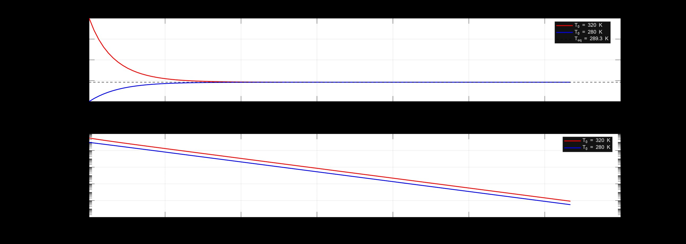

*Both initial conditions ($T_0 = 320$ K and $T_0 = 280$ K) converge to the same equilibrium temperature $T_{\text{eq}} = 289.3$ K. Bottom panel shows exponential decay of error on a log scale, demonstrating stable convergence.*

**Result**: Unique stable equilibrium at $T_{\text{eq}} = 289.3$ K (16.1°C)

The analytical equilibrium is found by setting $\frac{dT}{dt} = 0$:

$$
T_{\text{eq}} = \left(\frac{Q(1-\alpha)}{\varepsilon\sigma}\right)^{1/4}
$$

#### Part 3: Temperature-Dependent Albedo - Bistability

**Figure 5**: Albedo Function and Energy Balance Analysis

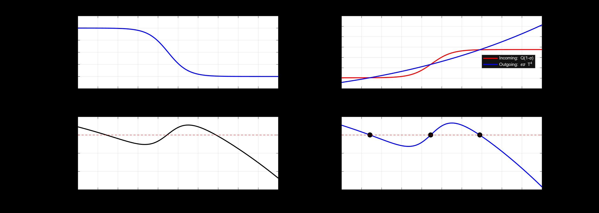

*Four-panel analysis revealing the mechanism of bistability:*
- *Top-left: Albedo as a function of temperature showing smooth transition from high (ice) to low (ice-free)*
- *Top-right: Incoming vs. outgoing radiation - intersection points are equilibria*
- *Bottom-left: Net energy flux showing three zero-crossings (three equilibria)*
- *Bottom-right: Phase portrait with marked equilibria - arrows indicate stability*

**Equilibrium Points**:
1. $T_1 = 234.2$ K (-39°C) - **STABLE** (Snowball Earth)
2. $T_2 = 264.4$ K (-8.7°C) - **UNSTABLE** (Tipping Point)
3. $T_3 = 288.9$ K (+15.7°C) - **STABLE** (Current Climate)

**Figure 6**: Demonstration of Bistability

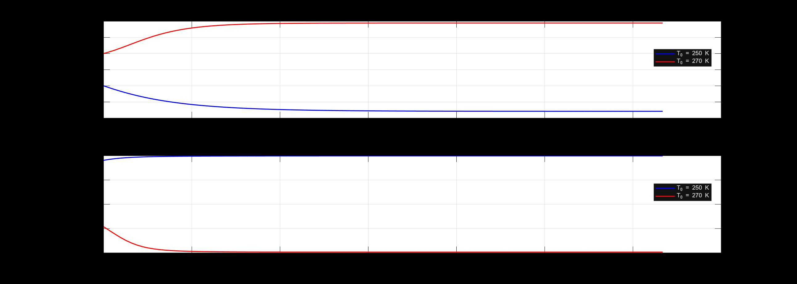

*Two trajectories from different initial conditions converge to different stable states:*
- *Blue: $T_0 = 250$ K → Snowball Earth ($T_{\text{final}} = 234.2$ K)*
- *Red: $T_0 = 270$ K → Warm Climate ($T_{\text{final}} = 288.9$ K)*
- *Bottom panel shows corresponding albedo evolution.*

**Figure 7**: Multiple Initial Conditions

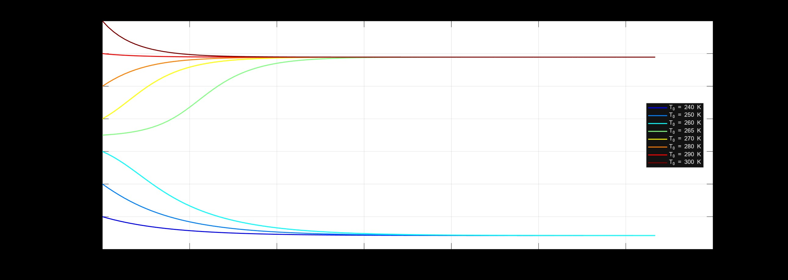

*Phase portrait showing the basin of attraction for each stable state. Initial conditions below $\sim$265 K lead to the frozen state (blue/cyan), while those above lead to the warm state (yellow/red). The critical temperature ($\sim$265 K) represents a climate tipping point.*

#### Physical Interpretation

**Ice-Albedo Feedback Loop**:
- **Positive feedback**: Cold → More ice → Higher albedo → Less absorption → Colder
- **Result**: Two stable climate states separated by an unstable equilibrium
- **Implication**: Small perturbations near the tipping point can trigger irreversible climate transitions

The stability of equilibria can be determined by analyzing the sign of $\frac{d}{dT}\left[\frac{dT}{dt}\right]$:
- **Stable** if $\frac{d}{dT}\left[\frac{dT}{dt}\right] < 0$ (negative feedback dominates)
- **Unstable** if $\frac{d}{dT}\left[\frac{dT}{dt}\right] > 0$ (positive feedback dominates)

---

### 3. Lotka-Volterra Predator-Prey Model

**File**: `lotka_volterra.m`

Classical predator-prey model demonstrating the importance of **numerical method selection** for conservative/Hamiltonian systems. Compares Forward Euler and RK4 integration schemes.

#### Model Equations

$$
\frac{dB}{dt} = B - BR \quad \text{(Prey growth)}
$$

$$
\frac{dR}{dt} = -R + BR \quad \text{(Predator dynamics)}
$$

Where $B$ = prey population, $R$ = predator population

#### Conservation Law

The Lotka-Volterra system conserves the quantity:

$$
H(B, R) = B - \ln(B) + R - \ln(R) = \text{constant}
$$

This conservation law implies closed orbits in phase space.

**Proof of Conservation**:

$$
\frac{dH}{dt} = \frac{\partial H}{\partial B}\frac{dB}{dt} + \frac{\partial H}{\partial R}\frac{dR}{dt}
$$

$$
= \left(1 - \frac{1}{B}\right)(B - BR) + \left(1 - \frac{1}{R}\right)(-R + BR)
$$

$$
= (B - 1)(1 - R) + (R - 1)(B - 1) = 0
$$

#### Numerical Methods Comparison

**Figure 8**: Time Series Comparison ($\Delta t = 0.2$)

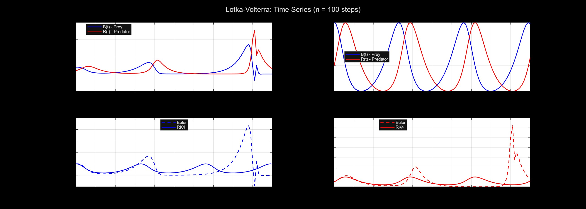

*Top panels show Euler (left) and RK4 (right) solutions. Bottom panels compare methods directly for prey (left) and predator (right) populations. Note the growing oscillations in Euler's solution.*

**Figure 9**: Phase Portrait Comparison ($\Delta t = 0.2$)

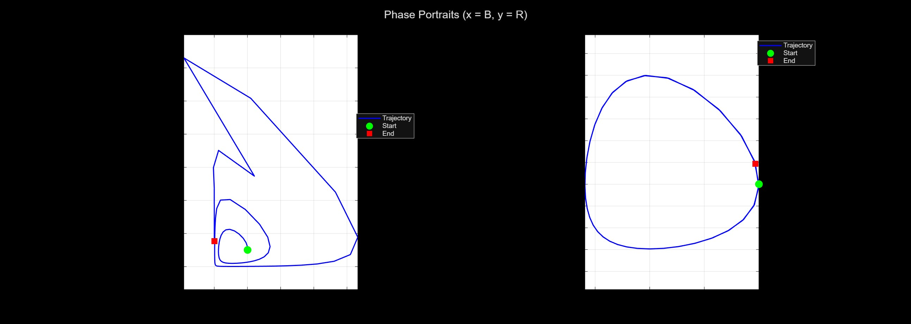

*Critical comparison showing:*
- *Left (Forward Euler): Trajectory spirals outward - physically incorrect behavior*
- *Right (RK4): Closed orbit - correct conservative dynamics*
- *Start (green) and end (red) points demonstrate divergence vs. periodicity.*

**Figure 10**: Effect of Time Step Size

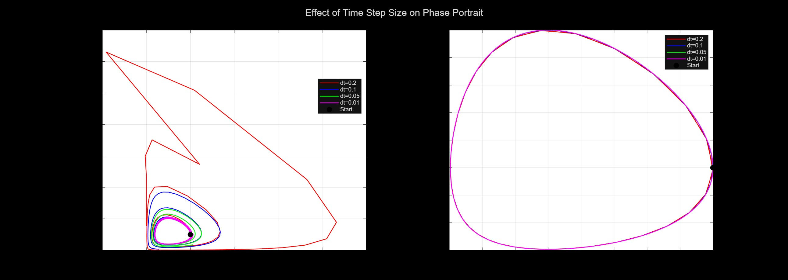

*Systematic study of $\Delta t$ dependence:*
- *Left (Euler): Catastrophic failure even with small $\Delta t$ - spirals outward and eventually crashes*
- *Right (RK4): Stable closed orbits for all tested time steps ($\Delta t = 0.2, 0.1, 0.05, 0.01$)*

**Figure 11**: Conservation Law Violation

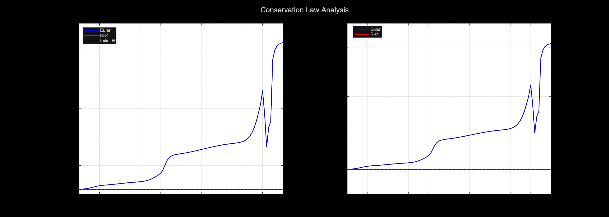

*Quantitative demonstration of conservation failure:*
- *Left: Forward Euler shows massive $H$ drift ($\Delta H \approx 10.3$)*
- *Right: RK4 maintains excellent conservation ($\Delta H \approx -2 \times 10^{-5}$)*

**Figure 12**: Phase Portraits for Different Initial Conditions (RK4)

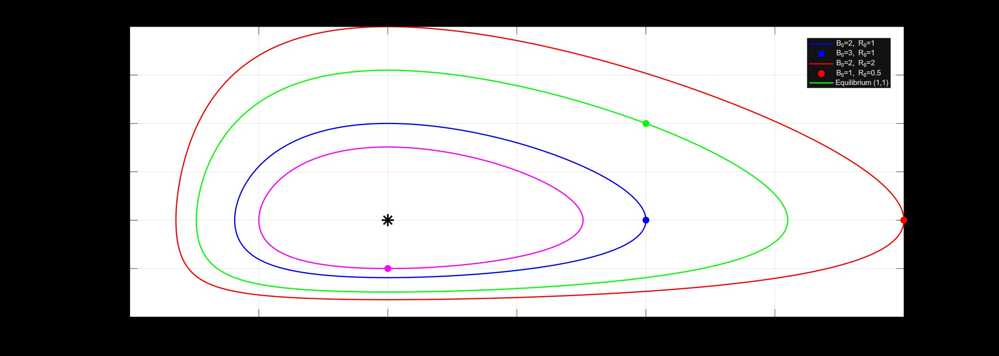

*Family of nested closed orbits representing different energy levels. All orbits encircle the equilibrium point $(1,1)$ marked with a black star. The orbit size depends on initial energy $H_0$.*

#### Numerical Results

**Conservation of $H$** (Initial $H = 2.306853$):

| Method | Final $H$ | Drift $\Delta H$ | 
|--------|---------|-------|
| Forward Euler | 12.6460 | +10.34 |  
| RK4 | 2.3068 | $-2.1 \times 10^{-5}$ |  

**Key Findings**:
- **Forward Euler fails catastrophically** for this Hamiltonian-like system
  - Energy drift of $\sim$450% over $t \in [0, 20]$
  - Spurious outward spiral instead of closed orbits
  - Would eventually lead to numerical overflow
- **RK4 performs excellently**
  - Energy conservation error: 0.001%
  - Properly captures periodic dynamics
  - Stable for all tested time steps

**Lesson**: For conservative/Hamiltonian systems, symplectic or high-order methods are essential. First-order explicit methods like Forward Euler systematically inject or remove energy, destroying the qualitative behavior.

---

## Requirements

- **MATLAB** R2018b or later
- No additional toolboxes required
- All implementations use base MATLAB functions

---

## Usage

Each script is self-contained and can be run independently:

```matlab
% Run Lorenz data assimilation
Lorenz

% Run energy balance climate model
energy_balance_model

% Run Lotka-Volterra comparison
lotka_volterra
```

### Customization

All parameters are defined at the beginning of each script and can be easily modified:

**Lorenz System**:
```matlab
sigma = 10;        % Prandtl number
r = 28;            % Rayleigh number
b = 8/3;           % Geometric factor
dt = 0.01;         % Time step
n_loc = 10;        % Assimilation frequency
obs_var = 2.0;     % Observation error variance
```

**Energy Balance Model**:
```matlab
epsilon = 0.6;           % Emissivity (greenhouse effect)
dt = 1e7;               % Time step (seconds)
T0_values = [240:10:300]; % Initial temperatures (K)
```

**Lotka-Volterra**:
```matlab
B0 = 2;             % Initial prey population
R0 = 1;             % Initial predator population
dt = 0.2;           % Time step
n_steps = 100;      % Number of steps
```

---

## Key Results

### Summary of Achievements

| Project | Key Result | Significance |
|---------|-----------|--------------|
| **Lorenz** | 99%+ correlation despite chaos | Data assimilation works even in chaotic systems |
| **Climate** | Two stable states (234K, 289K) | Climate tipping points are real and abrupt |
| **Lotka-Volterra** | RK4: 0.001% error; Euler: 450% drift | Method choice is critical for conservative systems |

### Computational Insights

1. **Chaos & Predictability**: Even perfect models have limited forecast skill in chaotic regimes, but data assimilation extends the predictability horizon.

2. **Nonlinear Bifurcations**: Simple climate models can exhibit complex behavior (bistability, hysteresis) due to positive feedbacks.

3. **Geometric Integration**: Not all numerical methods are created equal - structure-preserving properties matter for long-time accuracy.

---

## Mathematical Background

### Data Assimilation (Optimal Interpolation)

The analysis state combines forecast and observations:

$$
\mathbf{x}_a = \mathbf{x}_f + \mathbf{K}(\mathbf{y} - \mathbf{H}\mathbf{x}_f)
$$

Where the **Kalman gain** is:

$$
\mathbf{K} = \mathbf{P}_f \mathbf{H}^T (\mathbf{H}\mathbf{P}_f \mathbf{H}^T + \mathbf{R})^{-1}
$$

**Components**:
- $\mathbf{x}_f$ : Forecast state vector
- $\mathbf{y}$ : Observation vector
- $\mathbf{H}$ : Observation operator (identity in this case)
- $\mathbf{P}_f$ : Forecast error covariance matrix
- $\mathbf{R}$ : Observation error covariance matrix
- $\mathbf{K}$ : Kalman gain matrix

The **innovation** $(\mathbf{y} - \mathbf{H}\mathbf{x}_f)$ represents the mismatch between observations and forecast, weighted by the Kalman gain.

### Energy Balance Equation

Derived from the **first law of thermodynamics**:

$$
\text{Rate of temperature change} = \frac{\text{Energy in} - \text{Energy out}}{\text{Heat capacity}}
$$

Leading to:

$$
C \frac{dT}{dt} = (1-\alpha)Q - \varepsilon\sigma T^4
$$

**Physical terms**:
- $(1-\alpha)Q$ : Absorbed solar radiation
- $\varepsilon\sigma T^4$ : Outgoing thermal radiation (Stefan-Boltzmann law)

**Equilibrium condition** ($\frac{dT}{dt} = 0$):

$$
(1-\alpha)Q = \varepsilon\sigma T_{\text{eq}}^4
$$

For the bistable case with $\alpha(T)$, this becomes a **quartic equation** with potentially multiple roots.

### Lotka-Volterra Conservation

The conserved quantity $H$ can be derived from the **Hamiltonian structure**:

$$
H(B, R) = B - \ln(B) + R - \ln(R)
$$

**Equilibrium point**: Setting $\frac{dB}{dt} = \frac{dR}{dt} = 0$ gives $(B^*, R^*) = (1, 1)$

**Linearization** around equilibrium:

$$
\begin{bmatrix} \frac{dB}{dt} \\ \frac{dR}{dt} \end{bmatrix} = \begin{bmatrix} 0 & -1 \\ 1 & 0 \end{bmatrix} \begin{bmatrix} B - 1 \\ R - 1 \end{bmatrix}
$$

The Jacobian has **purely imaginary eigenvalues** $\lambda = \pm i$, indicating a **center** (neutrally stable equilibrium with closed orbits).

### Runge-Kutta 4th Order Method

The **RK4 scheme** for $\frac{dy}{dt} = f(t, y)$ is:

$$
k_1 = f(t_n, y_n)
$$

$$
k_2 = f(t_n + \frac{\Delta t}{2}, y_n + \frac{\Delta t}{2}k_1)
$$

$$
k_3 = f(t_n + \frac{\Delta t}{2}, y_n + \frac{\Delta t}{2}k_2)
$$

$$
k_4 = f(t_n + \Delta t, y_n + \Delta t k_3)
$$

$$
y_{n+1} = y_n + \frac{\Delta t}{6}(k_1 + 2k_2 + 2k_3 + k_4)
$$

**Local truncation error**: $\mathcal{O}(\Delta t^5)$  
**Global error**: $\mathcal{O}(\Delta t^4)$

---

## Repository Structure

```
.
├── Lorenz.m                   # Data assimilation on Lorenz system
├── energy_balance_model.m     # Climate bistability simulation
├── lotka_volterra.m           # Predator-prey numerical comparison
├── Images/                    # Visualization outputs
│   ├── 1.jpg                  # Lorenz: All components analysis
│   ├── 2.jpg                  # Lorenz: Z-component detail
│   ├── 3.jpg                  # Lorenz: Attractor visualization
│   ├── 4.jpg                  # Climate: Multiple initial conditions
│   ├── 5.jpg                  # Climate: Energy balance analysis
│   ├── 6.jpg                  # Climate: Bistability demonstration
│   ├── 7.jpg                  # Climate: Constant albedo case
│   ├── 8.jpg                  # Lotka: Conservation law
│   ├── 9.jpg                  # Lotka: Phase portraits (ICs)
│   ├── 10.jpg                 # Lotka: Time step effect
│   ├── 11.jpg                 # Lotka: Euler vs RK4
│   └── 12.jpg                 # Lotka: Time series comparison
└── README.md                  # This file
```

## 👤 Author

**Mehdi Hassanbeigi**  
**Email**: hasanbeigimahdi25@gmail.com 


---

##  Copyright Notice

**© 2025 Mehdi. All Rights Reserved.**

**Restrictions**:
- ❌ **No copying, modification, or distribution** of this work is permitted
